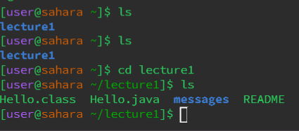

**Lab Report 1 -Remote Access and FileSystem (Week 1)**

In today's lab, we went into the basic filesystem commands: 'cd', 'ls', and 'cat'. 
These commands are fundamental for navigating and interacting with the filesystem in a Unix-like environment.
Let's explore each command by providing examples with and without arguments within the workspace we creating during this lab. 

**Command #1:** "cd" (Change Directory)

Example 1 -Using the 'cd' command with no arguments:

**Example 1** -Using the 'ls' command with no arguments:

Working Directory:
Explanation: When ls is used with no arguments, it lists the files and directories in the current working directory.
Output: Not an error. It lists the files and directories in the current directory.

**Example 2** -Using the 'ls' command with a path to a directory as an argument:

**Example 1** -Using the 'cat' command with no arguments:
![Image](
Working Directory:
Explanation: Running cat with no arguments is erroneous as it expects file inputs to concatenate and display.
Output: Error. It expects file inputs.

**Example 2** -Using the 'cat' command with a path to a directory as an argument:
![Image](
Working Directory:
Explanation: Providing a directory path as an argument to cat is incorrect as cat expects a file path.
Output: Error. It expects a file path, not a directory path.

**Example 3** -Using the 'cat' command with a path to a file as an argument:
![Image](
Working Directory:
Explanation: Using cat with a file path as an argument will display the content of the specified file.
Output: Not an error. It displays the content of the specified file. 
